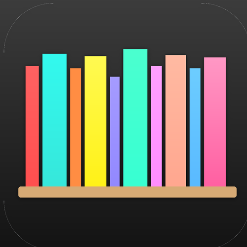

  

# Free Ebooks

> Maintained by [BookShelves eBook Reader](https://getbookshelves.app) — a free EPUB reader for macOS and iOS.

A curated list of places to find free, legal ebooks — public domain classics, open access academic works, and DRM-free downloads.

All sources listed here offer books you can actually own: download the file, read it in any ebook reader app, and keep it forever. No subscriptions, no expiring loans, no DRM.

## Public Domain Literature

| Source | Format | Description |
|--------|--------|-------------|
| [Standard Ebooks](https://standardebooks.org/) | EPUB | Beautifully formatted public domain books with modern typography and covers. The gold standard. |
| [Project Gutenberg](https://www.gutenberg.org/) | EPUB, HTML, TXT | The original free ebook library. 70,000+ titles. Raw text, minimal formatting. |
| [Internet Archive](https://archive.org/details/texts) | EPUB, PDF, DJVU | Massive digital library including scanned books, lending library, and open access texts. |
| [Feedbooks Public Domain](https://www.feedbooks.com/catalog) | EPUB | Clean EPUB downloads of public domain titles via OPDS catalog. |
| [ManyBooks](https://manybooks.net/) | EPUB, MOBI, PDF | 50,000+ free titles with user reviews and curated collections. |
| [Librivox](https://librivox.org/) | MP3, OGG | Free public domain audiobooks read by volunteers. Great companion to the text versions. |

## Open Access & Academic

| Source | Format | Description |
|--------|--------|-------------|
| [OAPEN](https://www.oapen.org/) | EPUB, PDF | Open access academic books. Peer-reviewed, free to download. |
| [DOAB](https://www.doabooks.org/) | Various | Directory of Open Access Books — aggregates OA titles from multiple publishers. |
| [OpenStax](https://openstax.org/) | PDF, Web | Free, peer-reviewed textbooks for college courses. |
| [MIT OpenCourseWare](https://ocw.mit.edu/) | PDF, Web | Course materials from MIT, including textbooks and readings. |
| [Open Textbook Library](https://open.umn.edu/opentextbooks) | PDF, Web | Faculty-reviewed open textbooks for higher education. |

## International & Multilingual

| Source | Format | Description |
|--------|--------|-------------|
| [Aozora Bunko](https://www.aozora.gr.jp/) | HTML, TXT | Japanese public domain literature. 18,000+ works. |
| [TextGrid Repository](https://textgridrep.org/) | XML, TXT | German-language digital texts and literary archives. |
| [BNE Digital Library](https://www.bne.es/en/collections/digital-library) | PDF, EPUB | Spanish National Library digitized collections. |
| [Wikisource](https://wikisource.org/) | Web, EPUB | Multilingual library of source texts in 70+ languages. |
| [Europeana](https://www.europeana.eu/) | Various | European cultural heritage — books, art, music, and more. |
| [Gallica](https://gallica.bnf.fr/) | PDF, EPUB | French National Library. Millions of digitized documents. |

## Where to Read Them

Any EPUB reader works. Here are some good ones:

| App | Platform | Description |
|-----|----------|-------------|
| [BookShelves](https://getbookshelves.app) | macOS, iOS | Free EPUB reader with built-in Standard Ebooks catalog. Browse and download directly from the app. |
| [Calibre](https://calibre-ebook.com/) | Windows, macOS, Linux | The Swiss Army knife of ebook management. Convert formats, edit metadata, organize your library. |
| [KOReader](https://koreader.rocks/) | Linux, Android, E-ink | Open source reader optimized for e-ink devices. Highly customizable. |
| [Apple Books](https://www.apple.com/apple-books/) | macOS, iOS | Built into every Apple device. Handles EPUB well. |
| [Foliate](https://johnfactotum.github.io/foliate/) | Linux | Clean, modern EPUB reader for GNOME. |

## What Is EPUB?

EPUB is the open standard format for ebooks. Unlike Kindle's proprietary format, EPUB files work in any compatible ebook reader — you're not locked into one company's ecosystem.

Key advantages:
- **Open standard** — supported by hundreds of apps and devices
- **Reflowable text** — adapts to any screen size
- **No DRM required** — the file is yours to keep and read anywhere
- **Rich formatting** — supports images, fonts, tables, and more

## What Is OPDS?

[OPDS](https://opds.io/) (Open Publication Distribution System) is like RSS for ebooks. It lets ebook reader apps browse and download from remote catalogs. Many of the sources above offer OPDS feeds, so you can discover and download books directly from your reader app.

## License

This list is released under [CC0 1.0](https://creativecommons.org/publicdomain/zero/1.0/) — do whatever you want with it.
